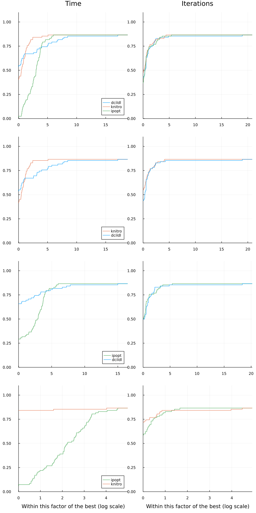

# Benchmarks

## CUTEst benchmark

With a JSO-compliant solver, such as DCI, we can run the solver on a set of problems, explore the results, and compare to other JSO-compliant solvers using specialized benchmark tools.
We are following here the tutorial in [SolverBenchmark.jl](https://jso.dev/SolverBenchmark.jl/v0.3/tutorial/) to run benchmarks on JSO-compliant solvers.

``` @example ex1
using CUTEst
```

To test the implementation of DCI, we use the package [CUTEst.jl](https://github.com/JuliaSmoothOptimizers/CUTEst.jl), which implements `CUTEstModel` an instance of `AbstractNLPModel`.

``` @example ex1
using SolverBenchmark
```

Let us select equality-constrained problems from CUTEst with a maximum of 100 variables or constraints. After removing problems with fixed variables, examples with a constant objective, and infeasibility residuals.

``` @example ex1
_pnames = CUTEst.select(
  max_var = 100,
  min_con = 1,
  max_con = 100,
  only_free_var = true,
  only_equ_con = true,
  objtype = 3:6
)

#Remove all the problems ending by NE as Ipopt cannot handle them.
pnamesNE = _pnames[findall(x->occursin(r"NE\b", x), _pnames)]
pnames = setdiff(_pnames, pnamesNE)
cutest_problems = (CUTEstModel(p) for p in pnames)

length(cutest_problems) # number of problems
```

We compare here DCISolver with [Ipopt](https://link.springer.com/article/10.1007/s10107-004-0559-y) (Wächter, A., & Biegler, L. T. (2006). On the implementation of an interior-point filter line-search algorithm for large-scale nonlinear programming. Mathematical programming, 106(1), 25-57.), via the [NLPModelsIpopt.jl](https://github.com/JuliaSmoothOptimizers/NLPModelsIpopt.jl) thin wrapper, with DCISolver on a subset of CUTEst problems.

``` @example ex1
using DCISolver, NLPModelsIpopt
```

 To make stopping conditions comparable, we set `Ipopt`'s parameters `dual_inf_tol=Inf`, `constr_viol_tol=Inf` and `compl_inf_tol=Inf` to disable additional stopping conditions related to those tolerances, `acceptable_iter=0` to disable the search for an acceptable point.

``` @example ex1
#Same time limit for all the solvers
max_time = 1200. #20 minutes
tol = 1e-5

solvers = Dict(
  :ipopt => nlp -> ipopt(
    nlp,
    print_level = 0,
    dual_inf_tol = Inf,
    constr_viol_tol = Inf,
    compl_inf_tol = Inf,
    acceptable_iter = 0,
    max_cpu_time = max_time,
    x0 = nlp.meta.x0,
    tol = tol,
  ),
  :dcildl => nlp -> dci(
    nlp,
    nlp.meta.x0,
    linear_solver = :ldlfact,
    max_time = max_time,
    max_iter = typemax(Int64),
    max_eval = typemax(Int64),
    atol = tol,
    ctol = tol,
    rtol = tol,
  ),
)

stats = bmark_solvers(solvers, cutest_problems)
```

The function `bmark_solvers` return a `Dict` of `DataFrames` with detailed information on the execution. This output can be saved in a data file.

``` @example ex1
using JLD2
@save "ipopt_dcildl_$(string(length(pnames))).jld2" stats
```

The result of the benchmark can be explored via tables,

``` @example ex1
pretty_stats(stats[:dcildl])
```

or it can also be used to make performance profiles.

``` @example ex1
using Plots
gr()

legend = Dict(
  :neval_obj => "number of f evals",
  :neval_cons => "number of c evals",
  :neval_grad => "number of ∇f evals",
  :neval_jac => "number of ∇c evals",
  :neval_jprod => "number of ∇c*v evals",
  :neval_jtprod  => "number of ∇cᵀ*v evals",
  :neval_hess  => "number of ∇²f evals",
  :elapsed_time => "elapsed time"
)
perf_title(col) = "Performance profile on CUTEst w.r.t. $(string(legend[col]))"

styles = [:solid,:dash,:dot,:dashdot] #[:auto, :solid, :dash, :dot, :dashdot, :dashdotdot]

function print_pp_column(col::Symbol, stats)

  ϵ = minimum(minimum(filter(x -> x > 0, df[!, col])) for df in values(stats))
  first_order(df) = df.status .== :first_order
  unbounded(df) = df.status .== :unbounded
  solved(df) = first_order(df) .| unbounded(df)
  cost(df) = (max.(df[!, col], ϵ) + .!solved(df) .* Inf)

  p = performance_profile(
    stats,
    cost,
    title=perf_title(col),
    legend=:bottomright,
    linestyles=styles
  )
end

print_pp_column(:elapsed_time, stats) # with respect to time
```

``` @example ex1
print_pp_column(:neval_jac, stats) # with respect to number of jacobian evaluations
```

## CUTEst benchmark with Knitro

In this second part, we present the result of a similar benchmark with a maximum of 10000 variables and constraints (82 problems), and including the solver [`KNITRO`](https://link.springer.com/chapter/10.1007/0-387-30065-1_4) (Byrd, R. H., Nocedal, J., & Waltz, R. A. (2006). K nitro: An integrated package for nonlinear optimization. In Large-scale nonlinear optimization (pp. 35-59). Springer, Boston, MA.) via [`NLPModelsKnitro.jl`](https://github.com/JuliaSmoothOptimizers/NLPModelsKnitro.jl). The script is included in [/benchmark/script10000_knitro.jl)](https://github.com/JuliaSmoothOptimizers/DCISolver.jl/blob/main/benchmark/script10000_knitro.jl). We report here a performance profile with respect
to the elapsed time to solve the problems and to the sum of evaluations of objective and constrain functions, see [/benchmark/figures.jl)](https://github.com/JuliaSmoothOptimizers/DCISolver.jl/benchmark/figures.jl) for the code generating the profile wall.


