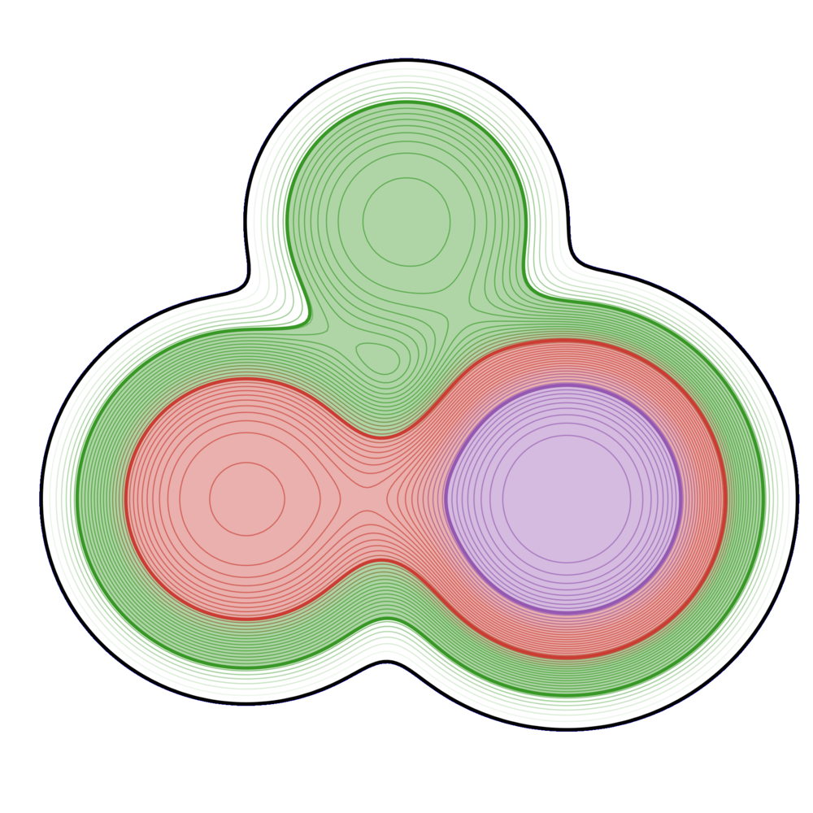

# Summary
(A summary describing the high-level functionality and purpose of the software for a diverse, non-specialist audience.)

DCISolver.jl is a new Julia implementation of DCI (Dynamic Control of Infeasibility), introduced by R.H. Bielschowsky and F.A.M. Gomes in [@bielschowsky2008dynamic], an algorithm for solving smooth nonlinear optimization models
with equality constraints:
\begin{equation}\label{eq:nlp}
    \min_{x \in \mathbb{R}^n} f(x) \quad \text{subject to } \quad h(x) = 0,
\end{equation}
where  $f:\mathbb{R}^n \rightarrow \mathbb{R}$ and  $h:\mathbb{R}^n \rightarrow \mathbb{R}^m$ are twice continuously differentiable.  \autoref{eq:nlp}
DCISolver is designed to help application experts to easily solve real-world problems, to help researchers improve compare and analyze new techniques too handle constraints, and also for its usage in numerical optimization courses.

# Statement of need
(A Statement of Need section that clearly illustrates the research purpose of the software.)

## The cylinder

The method uses the idea of using trust cylinders to keep the infeasibility under control.
Each time the trust cylinder is violated, a restoration step is called and the infeasibility level is reduced. 
The radius of the trust cylinder has a nonincreasing update scheme, so eventually a feasible (and optimal) point is obtained.
The numerical results suggest that the algorithm is promising.

The DCI algorithm is an iterative method that has the flavor of a projected gradient algorithm and could be characterized as
a relaxed feasible point method with dynamic control of infeasibility. The main idea is to compute a sequence of iterate  $\{x^k\}$ where each iterate belongs to a trust-cylinder  $C(\rho^k)$, so that, for all  $k=1,\dots$, it holds
\begin{equation}\label{eq:trust-cylinder}
    x^k \in C(\rho^k) := \{ x \in \mathbb{R}^n : \| h(x) \| \leq \rho^k \},  
\end{equation}
where the radii  $\rho^k$ is chosen such that
\begin{equation}\label{eq:radii}
    \rho^k = O\left(\|\nabla f(x^k) + \nabla h(x^k)^T \lambda\|\right),
%    \rho^k = O(\|g_p(x^k)\|),
% $g_p(x^k) := \nabla f(x^k) + \nabla h(x^k)^T \lambda$
\end{equation}
with  $\lambda$ an approximation of a Lagrange multiplier at  $x^k$ computed by 
\begin{equation}\label{eq:lag}
    \arg\min_{\lambda \in \mathbb{R}^m} \| \nabla f(x^k) + \nabla h(x^k)^T \lambda \|.
\end{equation}

The  $k$-th iteration of the algorithm consists of a normal and a tangent step. Given  $x^{k-1}$, the normal step computes a couple  $(x^k_c,\rho^k)$ satisfying  $x^k_c \in C(\rho^k)$. The sequence  $\{\rho^k\}$ is decreasing to zero.
On the other hand, the tangent step aims at reducing the dual feasibility and computes  $x^k:=x^k_c + d^k$ such that
\begin{equation}\label{eq:dual_feasibility_step}
    d^k \in \arg\min{d \in \mathbb{R}^n} \nabla f(x^k_c)^T d + \frac{1}{2} d^T B d \quad \text{subject to } \quad \nabla h(x^k_c) d = 0, \ \| d \| \leq \Delta,
\end{equation}
where  $B$ is a symmetric approximation of the Lagrangian Hessian at  $x^k_c$, and,  $\Delta>0$ is a trust-region parameter, in particular, chosen such that  $\|h(x^k)\| \leq 2\rho^k$. 

{ width=10% }

The following algorithm gives a concise presentation of the main steps. We refer to Algorithm~2.1 (page 4) [@bielschowsky2008dynamic] for an example of implementation of both steps, the computation of the radii, and the convergence analysis of the algorithm under standard assumptions.  

## JSO-solver

JuliaSmoothOptimizers (JSO) is an academic organization containing a collection of Julia packages for nonlinear optimization software development, testing, and benchmarking. It provides solvers and tools for building models, accessing repositories of problems, solving subproblems, and linear algebra.
The JSO organization benefits from Julia's expressive language and performance to offer all the tools to solve large-scale continuous optimization problems, research and design new methods in an accessible and efficient way. It strives for retaining efficiency, promoting expandability and code reuse at all levels. JSO provides an API to access optimization problems' functions and derivatives that can be specialized to a variety of different problems including optimization problems with partial differential equations in the constraints. A central point is that it also offers tools to improve the solver's quality, such as factorization and iterative solver packages for linear algebra and subproblem's solvers. With a few code lines, one can prototype a solver, compare with well-known solvers or pure-Julia implementations of solvers, and test on manually inputted problems or test problem sets. We refer to the website  \href{https://juliasmoothoptimizers.github.io/}{juliasmoothoptimizers.github.io} for tutorials.

{ width=10% }

A JSO-compliant solver essentially implies a constraint on the input and the output of the main function. The inputted problem must be an instance of an `AbstractNLPModel`. The output has to include a `GenericExecutionStats`, implemented in `SolverCore.jl`, which is a structure containing the available information at the end of the execution, such as a solver status, the objective function value, the norm of the gradient of the Lagrangian, the norm of the constraint function, the elapsed time, and a dictionary of solver specifics.

JSO provides a general consistent API, `AbstractNLPModel`, for solvers to interact with models by providing flexible data types to represent the objective and constraint functions, to evaluate their derivatives, and to provide essentially any information that a solver might request from a model.
Then, one can instantiate this abstract structure to different problems. We exploit Julia's multiple dispatch facilities to efficiently specialize instances to different contexts.
Hence, solvers can be designed to rely on the API's behavior independently of the problem's origin. Moreover, the API handles sparse Hessian/Jacobian matrices or operators for matrix-free implementations.
JSO also provides converters from classical mathematical optimization modeling language.

## Benchmarks

With a JSO-compliant solver, such as DCI, we can run the solver on a set of problems, explore the results, and compare to other JSO-compliant solvers using specialized benchmark tools `SolverBenchmark.jl`. 
To test the implementation of DCI, we use the package `CUTEst.jl`, which implements `CUTEstModel` an instance of `AbstractNLPModel`. Let us select equality-constrained problems from CUTEst with a maximum of 10000 variables or constraints. After removing problems with fixed variables, examples with a constant objective, and infeasibility residuals, we are left with 82 problems.

We can see on these two figures that our implementation DCI is doing extremely well in terms of execution time. It used more evaluation of functions than the well-known solvers, which is not necessarily a surprise as it is a very young implementation. Overall, these simulations show that it is possible to code efficient algorithms under JSO's umbrella.

# Acknowledgements

This research was partially supported by IVADO and the Canada First Research Excellence Fund / Apog\'ee,
and by an NSERC Discovery Grant.

# References
