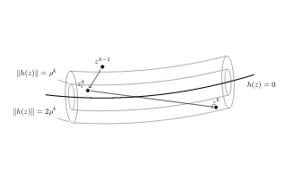
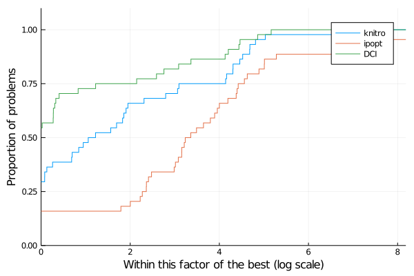

# Summary
(A summary describing the high-level functionality and purpose of the software for a diverse, non-specialist audience.)

DCISolver.jl is a new Julia implementation of the Dynamic Control of Infeasibility (DCI), introduced in [@bielschowsky2008dynamic], for solving nonlinear optimization models
with equality constraints:
\begin{equation}\label{eq:nlp}
    \min_{x \in \mathbb{R}^n} f(x) \quad \text{subject to } \quad h(x) = 0,
\end{equation}
where  $f:\mathbb{R}^n \rightarrow \mathbb{R}$ and  $h:\mathbb{R}^n \rightarrow \mathbb{R}^m$ are twice continuously differentiable.

The method uses the idea of using trust cylinders to keep the infeasibility under control.
Each time the trust cylinder is violated, a restoration step is called and the infeasibility level is reduced. 
The radius of the trust cylinder has a nonincreasing update scheme, so eventually a feasible and optimal point is obtained.

{ width=100% }

# Statement of need
(A Statement of Need section that clearly illustrates the research purpose of the software.)

DCISolver is designed to help application experts to easily solve real-world problems and to help researchers improve, compare and analyze new techniques too handle constraints without writing such algorithms themselves.
The user benefits from JuliaSmoothOptimizers's framework to solve nonlinear optimization problems from diverse nature in an accessible fashion, which makes it very suitable for numerical optimization courses.

(
There are similar solvers in other languages BUT Julia combines the performance of compiled languages with the productivity of interpreted ones by using type inference and justin-time compilation to generate fast code. As a result, there is no need to use two different
languages to write low-level performance code and high-level user interfaces.
)

(
We should also state why we needed a new algorithm - 
In Julia: compare to Ipopt [@wachter2006implementation], Percival [@percival-jl], interior-point Newton method in Optim.jl [@mogensen2018optim], MathOptInterface.jl [@legat2021mathoptinterface]
To the best of our knowledge, there are no available open source implementation of this solver.
)

## JSO-solver

JuliaSmoothOptimizers (JSO) is an academic organization containing a collection of Julia packages for nonlinear optimization software development, testing, and benchmarking. It provides solvers and tools for building models, accessing repositories of problems, solving subproblems, and linear algebra.
The JSO organization benefits from Julia's expressive language and performance to offer all the tools to solve large-scale continuous optimization problems, research and design new methods in an accessible and efficient way. 
With a few code lines, one can prototype a solver, compare with well-known solvers or pure-Julia implementations of solvers, and test on manually inputted problems or test problem sets. We refer to the website \href{https://juliasmoothoptimizers.github.io/}{juliasmoothoptimizers.github.io} for tutorials.

JSO provides a general consistent API, `AbstractNLPModel` defined in `NLPModels.jl` [@orban-siqueira-nlpmodels-2020], for solvers to interact with models by providing flexible data types to represent the objective and constraint functions, to evaluate their derivatives, and to provide essentially any information that a solver might request from a model.
Then, one can instantiate this abstract structure to different problems. 
The user can provide derivatives themselves, request that they are calculated using automatic differentiation or using JSO-converters from classical mathematical optimization modeling language (JuMP, Ampl ...).
We exploit Julia's multiple dispatch facilities to efficiently specialize instances to different contexts.
Moreover, the API handles sparse Hessian/Jacobian matrices or operators for matrix-free implementations.

A JSO-compliant solver essentially implies a constraint on the input and the output of the main function. The inputted problem must be an instance of an `AbstractNLPModel`. The output has to include a `GenericExecutionStats`, implemented in `SolverCore.jl`, which is a structure containing the available information at the end of the execution, such as a solver status, the objective function value, the norm of the gradient of the Lagrangian, the norm of the constraint function, the elapsed time, and a dictionary of solver specifics.

## Benchmarks

To test the implementation of DCI, we use the packages `CUTEst.jl` [@orban-siqueira-cutest-2020], which implements `CUTEstModel` an instance of `AbstractNLPModel`, and `SolverBenchmark.jl` [@orban-siqueira-solverbenchmark-2020] a package designed to run the solver on a set of problems, explore the results, and compare to other JSO-compliant solvers. Let us select 82 equality-constrained problems from CUTEst [@cutest] with a maximum of 10000 variables or constraints after removing problems with fixed variables, examples with a constant objective, and infeasibility residuals.
We ran a benchmark comparing DCI with Ipopt [@wachter2006implementation] and can see on the following figure that our implementation is doing extremely well in terms of execution time.

{ width=75% }

# Acknowledgements

Tangi Migot is supported by IVADO and the Canada First Research Excellence Fund / Apogée,
and Dominique Orban is partially supported by an NSERC Discovery Grant.

# References
