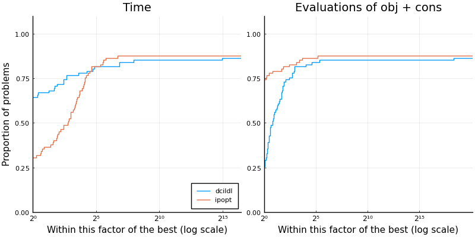

# Summary

`DCISolver.jl` is a new Julia implementation of the Dynamic Control of Infeasibility method (DCI), introduced by @bielschowsky2008dynamic, for solving the equality-constrained nonlinear optimization problem
\begin{equation}\label{eq:nlp}
    \underset{x \in \mathbb{R}^n}{\text{minimize}} \quad f(x) \quad \text{subject to} \quad h(x) = 0,
\end{equation}
where  $f:\mathbb{R}^n \rightarrow \mathbb{R}$ and  $h:\mathbb{R}^n \rightarrow \mathbb{R}^m$ are twice continuously differentiable.
DCI is an iterative method that aims to compute a local minimum of \eqref{eq:nlp} using first and second-order derivatives. Our initial motivation for developing `DCISolver.jl` is to solve PDE-constrained optimization problems, many of which have equality constraints only.

Each DCI iteration is a two-step process. A tangential step first approximately minimizes a quadratic model subject to linearized constraints within a trust region. A normal step then recenters feasibility by way of a trust cylinder, which is the set of points such that $\|h(x)\| \leq \rho$, where $\rho > 0$.
The idea of trust cylinders is to control infeasibility, contrary to penalty methods, which encourage feasibility by penalizing infeasibility.
Each time the trust cylinder is violated during the tangential step, the normal step brings infeasibility back within prescribed limits.
The radius $\rho$ of the trust cylinder decreases with the iterations, so a feasible and optimal point results in the limit.
For details and theoretical convergence, we refer the reader to the original paper [@bielschowsky2008dynamic].

`DCISolver.jl` is built upon the JuliaSmoothOptimizers (JSO) tools [@jso]. JSO is an academic organization containing a collection of Julia packages for nonlinear optimization software development, testing, and benchmarking. It provides tools for building models, accessing problems repositories, and solving subproblems. `DCISolver.jl` takes as input an `AbstractNLPModel`, JSO's general model API defined in `NLPModels.jl` [@orban-siqueira-nlpmodels-2020], a flexible data type to evaluate objective and constraints, their derivatives, and to provide any information that a solver might request from a model. The user can hand-code derivatives, use automatic differentiation, or use JSO-interfaces to classical mathematical optimization modeling languages such as AMPL [@fourer2003ampl], CUTEst [@cutest], or JuMP [@jump]. 

Internally, `DCISolver.jl` combines cutting-edge numerical linear algebra solvers. The normal step relies heavily on iterative methods for linear algebra from `Krylov.jl` [@montoison-orban-krylov-2020], which provides more than 25 implementations of standard and novel Krylov methods, and they all can be used with Nvidia GPU via CUDA.jl [@besard2018juliagpu].
The tangential step is computed using the sparse factorization of a symmetric and quasi-definite matrix via `LDLFactorizations.jl` [@orban-ldlfactorizations-2020], or the well-known Fortran code `MA57` [@duff-2004] from the @HSL, via `HSL.jl` [@orban-hsl-2021].

One of the significant advantages of our implementation is that the normal step is factorization-free, i.e., it uses second-order information via Hessian-vector products but does not need access to the Hessian as an explicit matrix.
This makes `DCISolver.jl` a valuable asset for large-scale problems, for instance to solve PDE-constrained optimization problems [@migot-orban-siqueira-pdenlpmodels-2021].
In the current implementation, the tangential step requires the explicit hessian, but removing that restriction is the subject of ongoing research, as is the treatment of inequality constraints.

# Statement of need

Julia's JIT compiler is attractive for the design of efficient scientific computing software, and, in particular, mathematical optimization [@lubin2015computing], and has become a natural choice for developing new solvers.

There already exist ways to solve \eqref{eq:nlp} in Julia.
If \eqref{eq:nlp} is amenable to being modeled in `JuMP` [@jump], the model may be passed to state-of-the-art solvers, implemented in low-level compiled languages, via wrappers thanks to Julia's native interoperability with such languages.
However, interfaces to low-level languages have limitations that pure Julia implementations do not have, including the ability to apply solvers with various arithmetic types.
`Optim.jl` [@mogensen2018optim] implements a factorization-based pure Julia primal-dual interior-point method for problems with both equality and inequality constraints modeled after Artlelys Knitro [@byrd2006k] and Ipopt [@wachter2006implementation].
`Percival.jl` [@percival-jl] is a factorization-free pure Julia implementation of an augmented Lagrangian method for problems with both equality and inequality constraints based on bound-constrained subproblems.

To the best of our knowledge, there is no available maintained open-source implementation of DCI in existence. The original authors did not make their implementation public, and the other known implementation is `dcicpp` [@dcicpp], extending the original method to inequalities in the Ph.D. thesis by @siqueira2013controle, and it has had no updates in the last 5 years. Hence, we offer an interesting alternative to augmented Lagrangian and interior-point methods in the form of an evolving, research level yet stable solver.

`DCISolver.jl` can solve large-scale problems and can be benchmarked easily against other JSO-compliant solvers using `SolverBenchmark.jl` [@orban-siqueira-solverbenchmark-2020].
We include below performance profiles [@dolan2002benchmarking] of `DCISolver.jl` against Ipopt on 82 problems from CUTEst [@cutest] with up to 10 000 variables and 10 000 constraints. Ipopt solved 72 problems (88%) successfully, which is one more than DCI. Without explaining performance profiles in full detail, the plot on the left shows that Ipopt is the fastest on 20 of the problems (28%), while DCI is the fastest on 51 of the problems (72%) among the 71 problems solved by both solvers. The plot on the right shows that Ipopt used fewer evaluations of objective and constraint functions on 50 of the problems (70%), DCI used fewer evaluations on 17 of the problems (24%), and there was a tie in the number of evaluations on 4 problems (6%).
Overall, this performance profile is very encouraging for such a young implementation.
The package's documentation includes more extensive benchmarks on classical test sets showing that `DCISolver.jl` is also competitive with Artelys Knitro.

<!--
illustrating that `DCISolver` is a fast and stable alternative to a state of the art solver

NOTE: Putting the code is too long
```
include("make_problems_list.jl") # setup a file `list_problems.dat` with problem names
include("benchmark.jl") # run the benchmark and store the result in `ipopt_dcildl_82.jld2`
include("figures.jl") # make the figure
```
-->

{ width=100% }

# Acknowledgements

Tangi Migot is supported by IVADO and the Canada First Research Excellence Fund / Apogée,
and Dominique Orban is partially supported by an NSERC Discovery Grant.

# References
